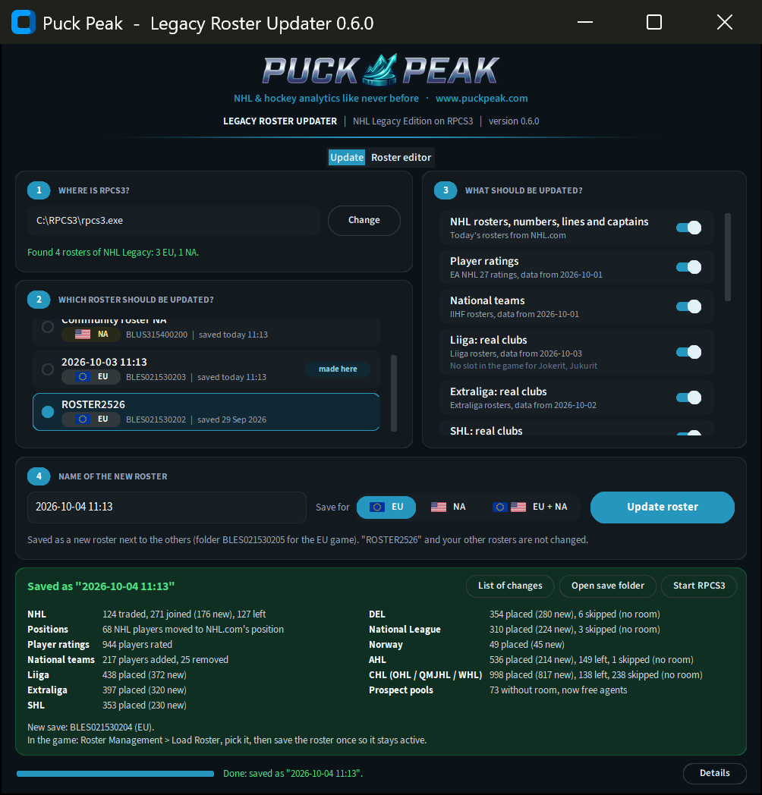

# NHL Legacy Roster Updater

**New here? Read the [Quick start](QUICKSTART.md)**, then download `NHLLegacyRosterUpdater.exe` from
[Releases](https://github.com/MatusRiedl/puckpeak-nhl-legacy-rosters/releases/latest).

Keeps the rosters of **NHL Legacy Edition** (PS3, played on RPCS3) up to date. You show it where
RPCS3 is, switch on what you want updated, and it saves a **new** roster named with today's date
and time. Your existing rosters are never changed.



## What it updates

| | What happens | Where the data comes from |
|---|---|---|
| NHL | Every player on his current team, at the position NHL.com lists, with jersey numbers, lines (left wings on the left, right wings on the right), captains, contracts | NHL.com, fetched when you press the button |
| Ratings | Player attributes for NHL players | EA NHL 27 ratings |
| National teams | Squads refreshed; every empty national team filled (also the ones a community roster left empty) | IIHF 2026 rosters and NHL players by nationality |
| Liiga | The 15 Finnish clubs with their real 2026-27 rosters, lines and captains | liiga.fi |
| Extraliga | The 14 Czech clubs likewise | hokej.cz |
| SHL | The 14 Swedish clubs | shl.se |
| DEL | The 14 German clubs | penny-del.org |
| National League | 12 of the 14 Swiss clubs | nationalleague.ch |
| Norway | Stavanger and Vålerenga, the two Norwegian clubs the game has | ehl.no |
| AHL | All 32 AHL teams with their real rosters; players on NHL contracts belong to their NHL club | theahl.com (HockeyTech) |
| CHL | The OHL, QMJHL and WHL clubs | the leagues' sites (HockeyTech) |
| Photos, logos and team names | Today's player photos, club logos and real team names in the game's menus | the leagues' sites, downloaded on your PC (see below) |

Everything is switched on to start with; switch off what you do not want. Every part passes the
program's safety check; SHL, DEL, National League, Norway, AHL and CHL have not been played in the
game by the project owner yet. Tell us how they work.

## No roster yet? Start from the game's own

You do not need a community roster. If RPCS3 lists the game, the window shows **The game's own
roster** (marked *start fresh*) under your saves. The program reads it from your copy of the game,
the 2014-15 players, and brings it up to today:

- Seattle and Vegas move into the All-Star teams' places. With "Photos, logos and team names" on,
  Utah, Seattle and Vegas show their names and logos in the NHL list.
- Players of 2014 who are 30 or older and on no team any more retire. Their places in the save go
  to today's players. Younger ones become free agents.
- Coachella Valley and Henderson are left out: the game's own roster has no team for them.
- The first roster of a game that has no save yet gets the game's own icon.

This is new in 0.6.0 and has not been played in the game yet. Tell us how it works.

## EU and NA

The European (`BLES02153`) and North American (`BLUS31540`) versions of the game read the same
roster file. The program finds the rosters of both and marks each one **EU** or **NA**. If your
RPCS3 has both versions, **Save for** (next to the roster name) saves the new roster for EU, NA or
both. It can even make the first roster of a version that has none yet. Photos, logos and team
names then go into both games too.

**About the club leagues.**

- **The game cannot hold more teams than it has slots.** These clubs are left out:
  - Liiga: Jokerit and Jukurit;
  - National League: Ajoie and Rapperswil-Jona;
  - WHL: Penticton;
  - Norway: every club except Stavanger and Vålerenga.
- **A club new to a league since 2015 takes the slot of one that left,** and keeps the old club's jersey.
  Its logo and its name in the menus are the old club's unless "Photos, logos and team names" is on
  (the game takes team names from its own text, not from the roster):
  - Kiekko-Espoo plays in the Espoo Blues slot;
  - Kladno in Chomutov's, České Budějovice in Zlín's;
  - Björklöven in Karlskrona's, Timrå in MODO's;
  - Frankfurt in Düsseldorf's, Bremerhaven in Hamburg's;
  - the AHL's Hamilton Hammers in Bridgeport's.
- **Prospect pools.** The community roster uses the European club slots for draft classes and NHL
  prospect pools. When a league gets its real clubs, pool players who are not on a real club move
  to spare custom teams named after their pool (under CUSTOM). There is room for 16 such teams of
  40. The best prospects keep their place; the rest become **free agents**, who keep their NHL
  rights and can be signed.
- **Players who leave a club** become free agents too. Nobody is deleted from the save.
- **Room for new players is limited.** The save has a fixed number of player records. New players take
  over blank records and those of long-retired, low-rated players (never legends, prospects or free
  agents). With every league switched on the records run out. Every club still gets the players it
  needs for a full line-up, but some junior depth players are skipped; the List of changes names them.
- **Ratings.** Club players are rated by estimate (league level, age, role), because EA publishes
  ratings for NHL teams and their farm players only.
- **What the leagues do not publish:**
  - The DEL lists each player's age, not his birthdate. A DEL player new to the game gets 1 July of the
    fitting year (the List of changes marks him).
  - The National League does not publish nationality, so its players new to the game are listed as Swiss.

**Photos, logos and team names.** With this switch on, the program also gives the players their
current photo and the clubs their current logo and real name in the game's menus. Examples: Kladno
instead of Chomutov; Utah, Seattle and Vegas instead of Arizona, Green and Black; names for
Coachella Valley, Henderson and the prospect pools. The game takes team names from its own text
file, so the program writes a corrected copy of that too:

- **RPCS3 must be closed** while it runs.
- **Pictures inside the program.** `NHLLegacyRosterUpdater.exe` carries about 4,300 photos and logos,
  so nothing needs downloading except players new since it was made. Those are downloaded once and
  kept on your PC, so no picture is ever downloaded twice.
- **Made for your game.** The pictures are turned into the game's own picture files on your PC,
  using templates from your copy of the game. Writing them takes a few minutes and about 600 MB.
- **Where they go.** The pictures and team names go into RPCS3's folder for the game
  (`dev_hdd0\game\BLES02153` for EU, `dev_hdd0\game\BLUS31540` for NA), not into your roster saves.
  A roster file (`SYS-DATA`) holds only each player's picture number. So a roster file you download
  and drop into a save folder does not bring or remove pictures: it shows the ones installed for
  the numbers it uses.
- **Custom teams** (under CUSTOM: the copies of 12 NHL teams with today's logos and jerseys,
  Coachella Valley, Henderson, the prospect pools) get a name in the menus as well.
- **The favourite team screens** ("Choose Your Favorite Team" when you start the game, and the
  favourite team in your settings) get the current logos too: Utah's instead of the Coyotes'.
- **Your own pictures are kept.** Before a picture is replaced, the one that was there is kept on
  your PC: the game's own, or one from a picture pack you installed yourself. If you install
  another pack later, its pictures are kept as well.
- **Undo.** **Restore the game's own pictures** in the window puts every file back as it was. Your
  rosters stay as they are.
- **Not covered:** the National League and Extraliga publish no player photos, so their players
  keep the game's pictures. Their club logos are covered.

**Roster editor.** The second tab of the window shows what a roster holds: every league, team
and player with position, number, age, nationality and overall, with the player's photo.

- **As is / To be.** "As is" is the roster you picked. **To be** shows what the update will make of
  it, with the switches of the Update tab, without saving (it takes a moment the first time).
  **Refresh update** makes it again. Green players joined a team, red ones left, and gold ones
  changed (for example "OVR 83 → 86").
- **The photo** on the right is the one the game shows now, or in "To be" the one the update
  brings (with "Photos, logos and team names" on).
- **Edit any player.** Name, number, position, shooting side, birthdate, country, height, weight,
  team (or free agent), every rating, and a **photo of your own** (any PNG or JPG; you see it as the game
  will). Then **Apply**.
- **Edit any team.** Full name, city, abbreviation and a **logo of your own** ("Edit this team").
- **New player.** Give a name, birthdate, team and overall. The save has a fixed number of player
  records, so new players use spare ones.
- **Your edits are kept** on this PC and applied again after every later update ("My edits" on the
  Update tab). The next download therefore does not undo them. **My edits** lists them, and you can
  remove any one.
- **Save as new roster** writes what you see as a new roster, after the same safety checks as an
  update.

## What you need

- Windows and RPCS3 with NHL Legacy Edition, European (`BLES02153`) or North American
  (`BLUS31540`), or both.
- A roster to start from: a **community roster** (the 2025-26 roster family or the community's
  2026-27 roster, also a file you put into a save folder by hand), or **the game's own roster**
  (see above). A roster you saved in the game without loading a community roster counts as the
  game's own.

## How to use it

1. Download `NHLLegacyRosterUpdater.exe` from the Releases page and start it.
2. **Where is RPCS3?** Pick the file `rpcs3.exe` in your RPCS3 folder. The program finds your
   saves from there, also when RPCS3 keeps its hard disk somewhere else or has several users. If
   RPCS3 is running, or you have used the program before, this is already filled in.
3. **Which roster should be updated?** Pick the roster to start from. Each one carries the flag of
   its version (EU or NA); rosters made by this program are marked *made here*; rosters it cannot
   use are greyed out with the reason. The game's own roster is at the end of the list.
4. **What should be updated?** Switch on what you want and press **Update roster**. It takes
   about a minute. With both versions of the game in RPCS3, choose first who gets the new roster
   (**Save for**: EU, NA or both).
5. In the game: *Roster Management > Load Roster*, pick the roster with the new date, then save
   it once so the game keeps it as the active roster.

The program writes a new folder next to your existing roster saves (for example
`BLES021530205`). To remove an update, delete that roster in the game or delete the folder.

When it is done, the window shows what each part did, one line each, and offers **List of
changes**, **Open save folder** and, when RPCS3 is not running, **Start RPCS3**. The list of changes
opens in your browser: every trade, call-up, new player and position change, grouped by league and
team, with a search box. The same list is saved as a spreadsheet file next to it.

## Good to know

- **Windows may warn about the exe.** It is not signed. Choose *More info > Run anyway*, or run it
  from source (below).
- **Safety check.** Before anything is saved, the new roster is tested against the rules the game
  enforces (checksums, line-ups, contracts, team limits). If a test fails, nothing is saved.
- **AHL teams** lose players to NHL call-ups. Switch on "AHL rosters" to fill them with their real
  players.
- **New players** who are not in the game's database get a generic face and no commentary name.
  Players EA does not rate keep the ratings they had, or get an estimate.
- **No internet?** Start it with `--offline` on the command line; it uses the data it shipped with.
- **"Could not connect safely"?** Check that the date and time on your PC are right. An antivirus
  that checks web traffic can also cause it: turn its web or HTTPS scanning off for a moment.
- **"Some of this program's files are missing"?** An antivirus or a cleaning program removed them
  while the program started. Start it again, and allow `NHLLegacyRosterUpdater.exe` in your antivirus.
- **Real PS3 console:** saves there are signed. Copy the new save over and re-sign it with a save
  tool such as Apollo. This is untested.

## Command line

`NHLLegacyRosterUpdater-cli.exe` does the same without a window:

```
NHLLegacyRosterUpdater-cli list   --rpcs3 "C:\RPCS3\rpcs3.exe"
NHLLegacyRosterUpdater-cli update --rpcs3 "C:\RPCS3\rpcs3.exe" --source BLES021530202 --leagues nhl,ratings,national,ahl
NHLLegacyRosterUpdater-cli export --rpcs3 "C:\RPCS3\rpcs3.exe" --source BLES021530202 --out tables
NHLLegacyRosterUpdater-cli update --rpcs3 "C:\RPCS3\rpcs3.exe" --source disc:NA
```

`--leagues` takes `nhl`, `ratings`, `national`, `liiga`, `extraliga`, `shl`, `del`, `nl`, `norway`,
`ahl`, `chl` or `all`; without it, everything is updated. `--for EU`, `--for NA` or `--for both`
chooses the version(s) of the game to save for (default: the version of the roster you start from).
`--source disc` (or `disc:EU`, `disc:NA`) starts from the game's own roster. `--photos` adds photos and
logos (RPCS3 closed); `NHLLegacyRosterUpdater-cli photos remove` takes them away. `--savedata <folder>` can be
given instead of `--rpcs3` to name a save folder directly. `export` writes every table of a roster as
CSV with readable column names, for roster editors.

## Running from source

Python 3.10 or newer. The command line needs nothing else; the window needs one package:

```
pip install customtkinter
python -m legacy_roster                      # the window
python -m legacy_roster update --rpcs3 ...   # the command line
```

Developers and AI agents: start with [AGENTS.md](AGENTS.md). It leads to how the program works
([docs/ARCHITECTURE.md](docs/ARCHITECTURE.md)), how to change and test it
([docs/DEVELOPING.md](docs/DEVELOPING.md)), how to refresh data and release
([docs/MAINTAINING.md](docs/MAINTAINING.md)), what is done and what is next
([docs/ROADMAP.md](docs/ROADMAP.md)) and the save format ([docs/FORMAT.md](docs/FORMAT.md)).

## Credits and legal

Built on the NHL Legacy community rosters (2025-26 and 2026-27) and their authors' team layout. NHL team
and player names belong to their owners. The program carries photos and logos published by the NHL,
ESPN, the leagues and Wikipedia; no game files are included (the game's own roster, its pictures'
templates and its icon are read from your copy of the game). It is not affiliated with EA Sports, the
NHL or the IIHF. Code is under the [MIT licence](LICENSE) (c) 2026 Matus Riedl.

A [Puck Peak](https://www.puckpeak.com) project (NHL & hockey analytics like never before): the
window wears Puck Peak's look and logo, and the logo links to www.puckpeak.com. It uses
[CustomTkinter](https://github.com/TomSchimansky/CustomTkinter) (CC0) and the font
[Source Sans 3](https://github.com/adobe-fonts/source-sans) (SIL Open Font License, included in
`legacy_roster/data/fonts`).
